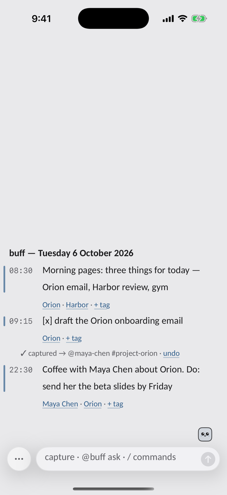
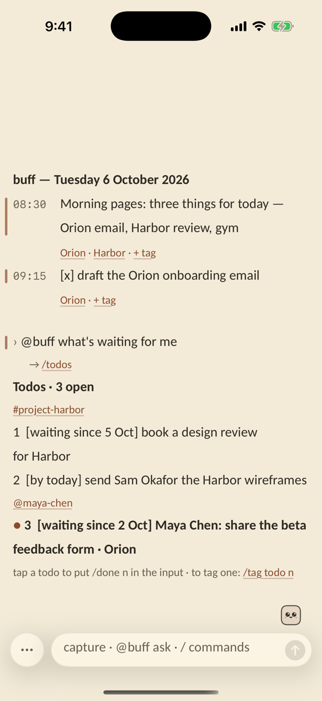
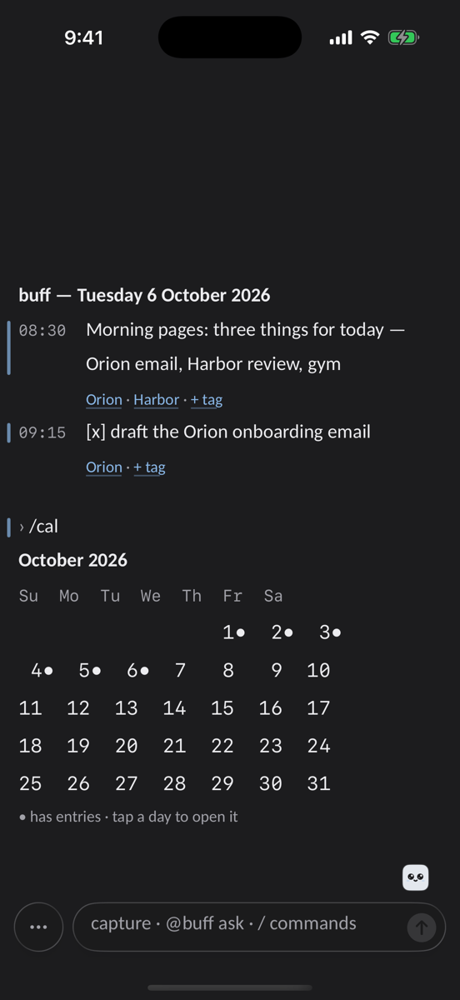
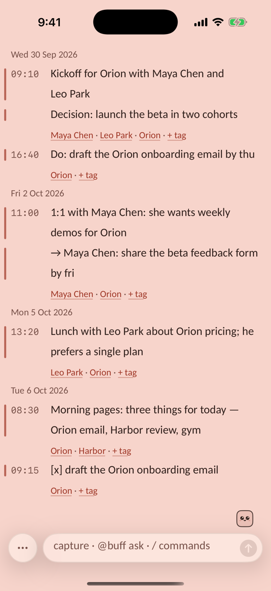
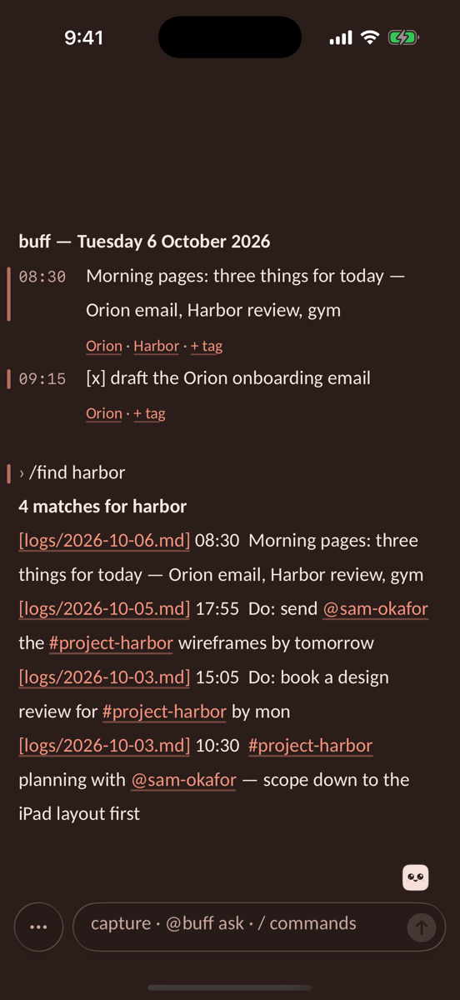
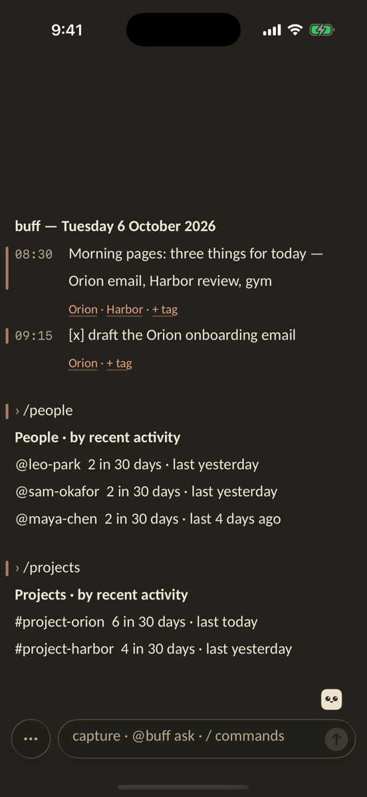

**buff remembers everything.** Write a line, press Send, and it's filed under today. Tag people and projects as you go, look back by day or by name, turn lines into todos, or just ask: `@buff what's waiting for me`.

Your notes stay plain markdown files in your own iCloud Drive. No account, no analytics, no ads.

Free for iPhone and iPad. Coming soon to the App Store.

<a class="button" href="{{ '/docs/' | relative_url }}">Read buff docs →</a> <a class="button secondary" href="{{ '/support/' | relative_url }}">Get support</a>

[buff docs](docs/index.md) · [Privacy policy](privacy.md) · [Support](support.md)
